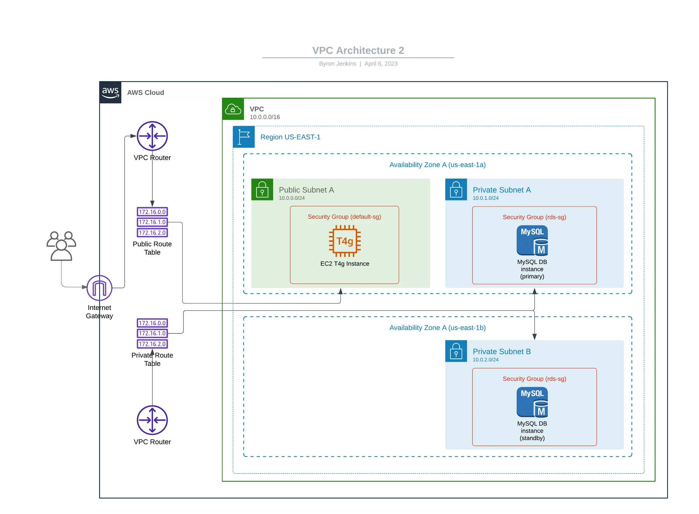

# RDS and EC2 example

AWS MySQL RDS and EC2 Terraform example. 

[Read the supporting Medium article for a walkthrough](https://medium.com/@codeherk/creating-aws-mysql-rds-and-ec2-with-terraform-42e0ebc5b2d9)

## Table of Contents

- [Prerequisites](#prerequisites)
- [Documentation](#documentation)
- [Getting Started](#getting-started)
- [Contributing](#contributing)

## Prerequisites

- Terraform installed
    - via Chocolately for Windows
    - via Homebrew for Mac
- AWS CLI user created (done via AWS IAM on AWS console) 
- (Optional) Terraform VSCode Extension installed. Helps with Syntax highlighting and autocompletion for Terraform.

## Documentation



- 1 VPC
- 1 Public Subnet
    - In Availability Zone A (10.0.0.0/24)
    - EC2 instance will be launched here and accessible to the public
- 2 Private Subnets
    - 1 in Availability Zone A (10.0.0.1/24)
    - 1 in Availability Zone B (10.0.0.2/24)
    - RDS instances will be launched here and they won’t be accessible to the public. Only the EC2 instance will be able to reach the RDS instances
- 2 Route Tables (Routes traffic to specific subnets)
    - 1 Private Route Table (No internet access)
    - 1 Public Route Table (Has Internet Access)
- 1 Internet Gateway (Grants Internet Access to Public Subnets)
- 4 Security Groups Rules
    - EC2 Security Group inbound rule(s) to allow:
        - SSH - 22 from 0.0.0.0/0 (Allows anyone to SSH into the instance) Consider tightening this by using the IP address of your computer
        - HTTP - 8090 from 0.0.0.0/0 (Allows HTTP request. We will expose API endpoint here)
    - EC2 Security Group outbound rule to allow:
        - “-1” (Any Protocol) - from 0.0.0.0/0
        Allows any outbound traffic to anywhere. We need this to download and update the packages (Git, MySQL client) on the EC2 instance.
    - RDS Security Group with Inbound rule to allow:
        - MYSQL - 3306 from EC2 Security Group (Allows connection from EC2 instance)
- 1 EC2 Instance
- 2 MySQL RDS Instances
- 1 IAM Role
    - With ReadOnlyAccess for SSM
- 1 IAM Instance Profile
    - EC2 instance will use this to assume IAM Role to read secret from SSM
- 1 .pem file
    - Allows us to SSH into the EC2 instance
    EC2 instance and two RDS MySQL Instances. With Terraform, we will provision the EC2 instance in a public subnet for the API and a MySQL RDS instance in two private subnets each to achieve Multi-AZ.


## Getting Started

- Clone repo
- In terminal, navigate to `rds-private` folder
    - `cd terraform-aws-examples/rds-private`
- Run
    ```bash
    terraform init
    terraform apply
    ```

## Contributing

I appreciate any feedback and contribution to this repo! Feel free to create a PR with your purposed changes.